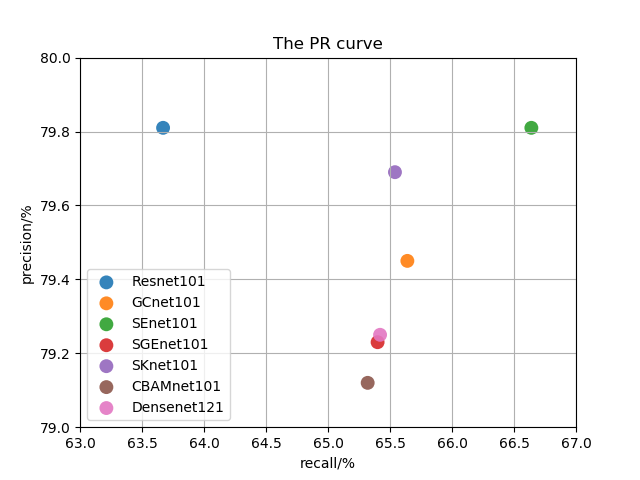
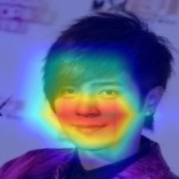

# FaceAttr-Analysis

This repo is for the adavanced training on deeping learning with the purpose of building a face attributes analysis application.

## Plan

### Dataset

- CelebA: about 162770 train images and  about 39829 test images. （with precropped images, but it's better to try wild images.）
- LFWA: (todo...because the original dataset link is invalid...)  

### Methods

- [x] v1:resnet101 (self-defined fc + BCE loss with logits + average accuracy)
- [x] v2:resnet101  (self-defined fc + BCE loss with logits + threshold rescaling (`from page 67,Machine Learning, Zhihua Zhou`) + average accracy + more metrics (recall, precision, TPR, FPR, F1 `from page 30-33,Machine Learning, Zhihua Zhou`))
- [x] v3+v5: try GC_resnet101 after modifying label format and loss.
- [x] v4: resnet101 + focal loss.
- [x] v6: se_resnet101
- [x] v7: resnet152
- [x] v8: densenet121
- [x] v9: [SGE_resnet101](https://arxiv.org/pdf/1905.09646.pdf).
- [x] V10: [SK_resnet101](https://arxiv.org/pdf/1903.06586.pdf).

Some model's codes are from [PytorchInsight](https://github.com/implus/PytorchInsight) and [pytorch.torchvision](https://pytorch.org/docs/stable/torchvision/models.html#classification).Thx!


## Experiment Result

### Our Work

| Solution | average accuracy(%) | macro-precision(%) | macro-recall(%) | macro-F1(%) |
| ---- | -----| ---- | ----- | ----- |
| Resnet101 | 91.53 | **79.81** | 63.67 | 68.52 |
| GCnet101 | 91.94| 79.45 |65.64 |69.94|
| SEnet101 | **91.95** | 79.81 | **65.64** | **69.99** |
| Densenet121| 91.64 | 79.25 | 65.42 | 69.81 |
| SGEnet101 | 91.60 | 79.23 | 65.40 | 69.77|
| SKnet101 | 91.93 | 79.69 | 65.54 | 69.95|
| CBAMnet101 | 91.42 | 78.12 | 65.32 | 69.24|
| Resnet152 | **91.95** | 79.46 | **65.98** | **70.14** |

More detailed data can be seen in folder [\result](https://github.com/JoshuaQYH/FaceAttr-Analysis/blob/master/result/).





Some explanable results for the model by using Grad-CAM.

Bald.


Eyeglasses


Female and Male




Wear hat


### State of the Art


> The image is from this paper--[FAN,Youtu Search, IJCAI 2018](https://www.ijcai.org/proceedings/2018/102)

## Simple Dashbord

Done:

- [x] [Dataset attribute analysis](https://github.com/JoshuaQYH/FaceAttr-Analysis/blob/master/analysis_attr.py).
- [x] [Data process and load](https://github.com/JoshuaQYH/FaceAttr-Analysis/blob/master/CelebA.py).
- [x] [Built baseline model(Resnet18 and 101)](https://github.com/JoshuaQYH/FaceAttr-Analysis/blob/master/FaceAttr_baseline_model.py).
- [x] [Train and evaluate](https://github.com/JoshuaQYH/FaceAttr-Analysis/blob/master/solver.py).
- [x] Save and load model.
- [x] More detailed analysis about the experiment results.
- [x] Parse the input script command.
- [x] Try more famous models, such as ~~ResNet101~~, ~~DenseNet~~, ~~SKNet~~, ~~SGENet~~, ~~SENet~~, ~~GCNet~~.
- [x] Customize the network structure for better performance.
- [x] upload images in html and return the analysis result.

More study notes on the [DailyNote.md](https://github.com/JoshuaQYH/FaceAttr-Analysis/blob/master/DailyNote.md)

## Usage

The pretrianed model `Resnet18` is availabel. Click [Google Drive](https://drive.google.com/open?id=1v0-Y-JMyuxHiJoWUcu9c58TCeyBKLOuD) .

Open the `run.sh` file, read the main.py and you can see the running arguments of model.
> bash run.sh
> 

If you want to train and test model by yourself, you can run this command:

```shell
nohup python main.py --model_type Resnet18 --batch_size 32 --epochs 128 --learning_rate 1e-3 --exp_version v1 &
```

If you want to visulize the model, you can download pretrianed model and see comments in main part in file `featuremap_visulize.py` for the usage, and just run:

```shell
python featuremap_visulize.py
```

## Problems

- Sample attributes imbalance.
- Need more effective learning strategies on multi-label task. (loss function? network structure?...)
- The wild images differ from training and test image (aligned)

## Related Resource

- [multi-task-learning](https://paperswithcode.com/task/multi-task-learning)
- [image classification](https://paperswithcode.com/task/image-classification)
- [LFWA Face Attribute DataBase](http://vis-www.cs.umass.edu/lfw/)

## Dependency & OS

> pip install -r requirements.txt   # requirements.txt created by cmd: pipreqs ./
> 
> linux 16.0.1

## License

[MIT](https://github.com/JoshuaQYH/FaceAttr-Analysis/blob/master/LICENSE).
